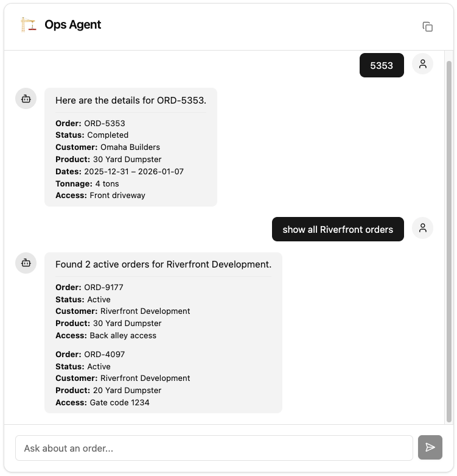

# Industrial Rental Ops Agent

AI-powered operations assistant for an industrial rental marketplace (dumpsters, portable toilets, fencing).
Helps ops staff triage issues by querying orders, checking customer sentiment, and finding active rentals — all through natural language.



## Quick Start

```bash
echo "ANTHROPIC_API_KEY=sk-ant-..." > .env
docker-compose up
```

Open [http://localhost:8000](http://localhost:8000)

## Tech Stack

**Backend:** Python 3.12, [pydantic-ai](https://ai.pydantic.dev/), FastAPI, SQLAlchemy, SQLite, [sse-starlette](https://github.com/sysid/sse-starlette)

**Frontend:** React 19, TypeScript, Vite, Tailwind CSS v4, shadcn/ui, [@agenisea/sse-kit](https://github.com/agenisea/sse-kit) ([npm](https://www.npmjs.com/package/@agenisea/sse-kit))

**LLM:** Claude Sonnet 4.5 (primary) → Claude Haiku 4.5 (fallback) via Anthropic API

**Testing:** pytest, pydantic-evals, Ruff

**Deployment:** Docker (single container), uv

## Capabilities

| Tool | Description | Example |
|------|-------------|---------|
| `lookup_order` | Order details by code — status, product, tonnage, access/gate codes, dates | "What's the status of ORD-5353?" |
| `get_order_sentiment` | Sentiment analysis from customer messages — overall score + flagged messages | "How's the customer feeling about ORD-9910?" |
| `find_active_orders` | All active rentals for a company — joins users to orders by company name | "Show me active orders for Chase Construction" |

## How It Works

The agent uses **pydantic-ai** with tool calling — CSV data is loaded into SQLite at startup and queried through Python tool functions. The LLM never sees raw data in its context, so this scales to millions of rows.

Responses stream via **Server-Sent Events** so the user sees real-time progress:

```
event: thinking   → data: {"message": "Processing your request..."}
event: tool_call  → data: {"message": "Looking up order ORD-5353..."}
event: complete   → data: {ChatResponseEnvelope}
```

## Architecture

```
Browser → POST /api/chat → FastAPI (SSE) → pydantic-ai agent.iter()
                                                │
                                         LLM selects tool(s)
                                                │
                                         ┌──────┴──────┐
                                         │  Tool Fns   │
                                         │  (SQLite)   │
                                         └──────┬──────┘
                                                │
                                         AgentResponse
                                         (Pydantic-validated)
                                                │
Browser ← SSE: thinking/tool_call/complete ← FastAPI
```

## Data Model

```
User (10)              Order (20)                Product (3)
┌──────────┐    1:N    ┌─────────────────┐  N:1   ┌──────────────────┐
│ id       │◄──────────│ user_id (FK)    │───────►│ id               │
│ username │           │ code  "ORD-"    │        │ name             │
│ is_active│           │ status          │        │ included_tonnage │
└──────────┘           │ waste_type_id   │        │  _quantity       │
                       │ access_details  │        └──────────────────┘
                       │ conversation_id─┤
                       │ start/end_date  │
                       └─────────────────┘
                                         │
                                    1:N  │  (via conversation_id)
                                         ▼
                                  Message (60)
                                  ┌─────────────────┐
                                  │ conversation_id │
                                  │ message         │
                                  │ sentiment_label │
                                  │ created_on      │
                                  └─────────────────┘
```

## Local Development

```bash
# Backend
uv sync
export ANTHROPIC_API_KEY=sk-ant-...
uv run uvicorn ops_agent.main:app --reload

# Frontend (separate terminal)
cd frontend && pnpm install && pnpm dev
# Dev server proxies /api → localhost:8000

# Tests
uv run --extra dev pytest tests/ -v
uv run --extra dev ruff check src/ tests/ evals/

# Evals (pydantic-evals)
uv run --extra dev python -m evals.eval_tools   # deterministic, no LLM
uv run --extra dev python -m evals.eval_agent   # real Anthropic API calls
```

## Project Structure

```
src/ops_agent/
  models/          # SQLAlchemy ORM (User, Order, Product, Message)
  repositories/    # Data access layer (Protocol-based)
  services/        # CSV → SQLite loader
  agent/           # pydantic-ai agent, tools, system prompt, schemas
  api/             # FastAPI routes (SSE streaming)

frontend/src/
  components/chat/           # Chat UI (window, messages, input, copy)
  components/chat/agent-response/  # Structured data rendering (orders, sentiment)
  hooks/                     # SSE streaming hook
  types/                     # API type definitions

evals/             # Tool evals (deterministic) + agent evals (LLM)
tests/             # pytest unit + integration tests
data/              # CSV seed files
```

---

Built by Agenisea™ 🪼
